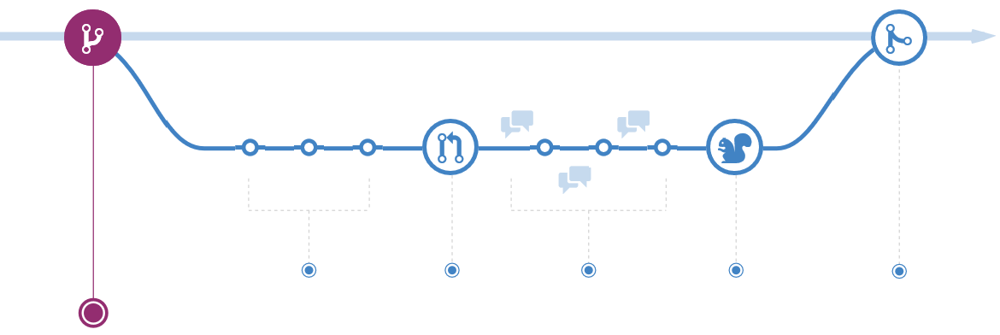
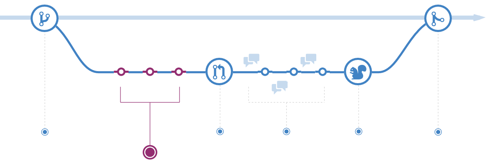
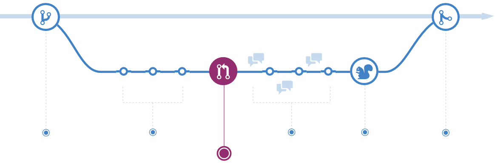
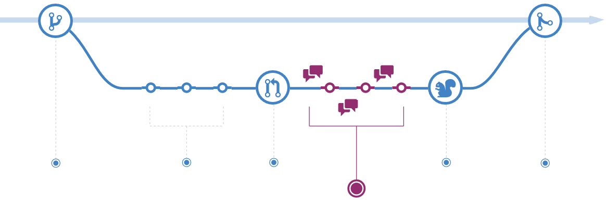
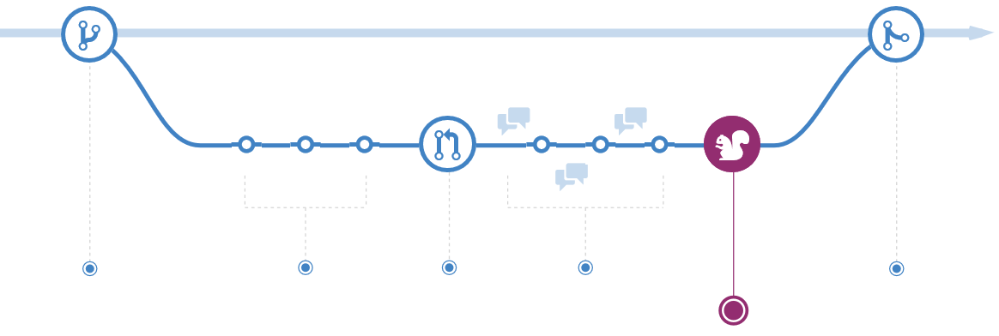
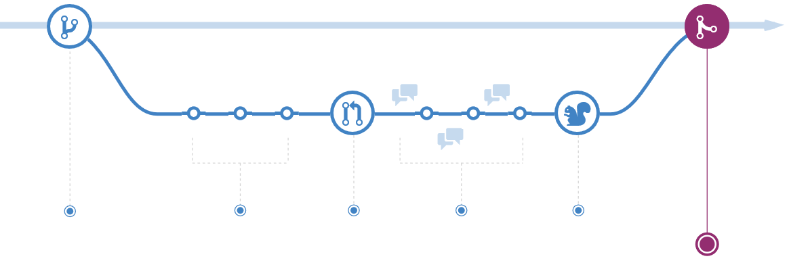

출처: https://guides.github.com/introduction/flow/

# 깃허브 흐름 알기

깃허브 흐름은 가볍고, 가지기반 작업순서이다 이것은 팀과 과제를 규칙적으로 만들어 배치하는것을 지원한다. 이 안내는 깃허브 흐름이 어떻게 작동하는지 그리고 이유를 설명한다.

---

## 1. 가지 만들기

 자신의 과제를 작업할 때, 진행중인 어떤 일정 시점에 특징과 아이디어 뭉치를 가질 것이다 - 그중 일부는 진행할 준비가 되었다, 그리고 다른 일부는 그렇지 않다. 가지뻗기는 작업순서 관리를 도와주기 위해 존재한다.

 자신의 과제에서 가지를 만들 때, 새로운 아이디어를 시도해 볼수 있는 자신만의 환경을 만드는 것이다. 가지에서 변경한 사항은 줄기에 영향을 주지 않는다, 그러므로 자유롭게 실험할 수 있다 그리고 지르기로 변경한다, 안심하라 자신의 가지합치기가 되지 않는것을 이것이 자신이 협력하는 누군가 검토가 끝날때 까지.

#### 전문기법

 가지뻗기(브랜칭)는 깃에서 핵심 개념이다, 그리고 깃허브 흐름 전체는 이것을 기반으로 한다. 이것이 유일한 규칙이다: 모든 줄기에서 가지를 뻗을 수 있다.

 이 때문에, 특징 또는 수정 작업을 할때 줄기에서 벗어난 자신의 새로운 가지를 만드는 것이 매우 중요하다. 자신의 가지이름을 반드시 설명해야 한다(예: `refactor-authentication`, `user-content-cache-key`, `make-retina-avatars`), 그러므로 무슨 작업을 하고 있는지 다른 사람이 알수 있다.

---

## 2. 지르기 추가

 일단 자신의 가지(브랜치)가 생성되면, 변화를 시작할 시점이다. 파일을 추가, 수정 또는 삭제할 때마다 지르기(커밋)를 한다, 그리고 자신의 가지에 추가(밀기, pushing)한다. 지르기를 추가하는 이 절차는 특징 가지에서 작업할 때 자신의 진척상황을 추적한다.

 지르기는 또한 다른사람이 자신이 한 일과 이유를 이해할 수 있는 투명한 작업기록을 생성한다. 각 지르기는 관련된 지르기 소식을 가진다, 이것은 특정 변경이 이루어진 이유를 설명하는 것이다. 더욱이 각 지르기는 변경 구분단위로 간주한다. 이렇게 하면 버그가 발견되거나, 다른 방향으로 나아가기로 결정한 경우 변경사항을 되돌릴 수 있다.

#### 전문기법

 지르기 소식은 중요하다, 특히 깃이 자신의 변경사항을 추적하고 표시하기 때문이다 한번 서버에 밀어넣기를 지르기면. 명확한 지르기 소식을 작성함으로써, 다른사람이 쉽게 따라할 수 있게 만든다 그리고 제공의견을 받을 수 있다.

---

## 3. 긁어오기요청 열기

 긁어오기요청은 자신의 지르기에 대한 조율을 시작한다. 왜냐하면 그것들은 기본 깃 저장소와 단단히 통합되어 있다. 그들이 당신의 요청을 수락하면 합치기된 변경을 누구든지 정확히 볼 수 있다.

 개발과정 중에 모든 지점에서 긁어오기요청을 열수 있다: 당신의 코드가 거의 없거나 전혀 없을 때 그러나 일부 스크린샷 또는 일반 아이디어를 공유하고 싶을 때, 당신이 막혔거나 도움 또는 조언이 필요할 때 아니면 누군가 당신의 작업에 조율할 준비가 되었을 때. 당신의 긁어오기요청 소식에서 깃허브의 @언급하기 몸통을 사용하여, 특정 사람이나 단체의 제공의견에 대해 물어볼 수 있다, 나락으로 떨어지던지 아니면 10시간 차이가 있던지 어떤지.

#### 전문기법

 긁어오기요청은 자료공개 과제에 이바지 하고 공유 저장소 변경 관리를 위해 유용하다. 만약 찍기 & 긁어오기 모형(Fork & Pull Model)을 사용하는 경우, 긁어오기요청은 당신이 고려하고 싶은 변화에 대해 과제 관리자에게 알리는 방법을 제공한다. 만약 공유된저장소 모형(Shared Repository Model)을 사용하는 경우, 긁어오기요청은 제안된 변경사항에 대한 코드 조율 및 대화를 시작하는데 도움이 된다 줄기(master branch)에 합치기 전에.

---

## 4. 자신의 코드 조율 및 검토

 한번 긁어오기요청이 열리면, 자신의 변경사항을 검토하는 사람 또는 단체의 질문 또는 의견이 있을 수 있다. 아마도 코딩스타일이 과제 지침과 일치하지 않거나, 변경사항 단위평가가 누락되었거나, 아니면 어쩌면 모든게 멋지고 우선순위가 될 것이다. 긁어오기요청은 이러한 대화를 장려하고 포착하도록 설계되었다.

 당신은 또한 지르기에 대한 조율과 제공의견을 토대로 자신의 가지에 계속 밀어넣기를 할수 있다. 만약 누군가 자신이 무언가를 잊었거나 또는 코드에 버그가 있다고 말한 경우, 자신의 가지에서 수정하고 변경사항을 밀어넣기를 할수 있다. 깃허브는 자신의 새로운 지르기를 보여준다 그리고 모든 추가적인 제공의견은 통합된 긁어오기요청 보기에서 받을 수 있다.

#### 전문기법

 긁어오기요청 의견은 표식하기로 기록된다, 그러므로 이미지와 이모지, 미리정의양식 문자 상자 사용, 그리고 다른 가벼운 양식을 소박이할 수 있다.

---

## 5. 투입

 깃허브로, 생산물을 최종평가하기 위하여 가지에서 투입할수 있다 줄기에 합치기 전에.

 일단 당신의 긁어오기요청이 검토되고 자신의 평가가 통과된 가지는, 생산물을 검증하기 위한 자신의 변경사항을 투입할 수 있다. 만약 자신의 가지가 문제를 일으키면, 기존 줄기에 있는 것으로 생산물에 되돌릴수 있다.

---

## 6. 합치기

 이제 당신의 변경이 생산물로 검증되었다, 이것은 당신의 코드가 줄기로 합치기할 시간이다.

 일단 합쳐지면, 긁어오기요청은 당신의 코드로 변경한 이력을 기록한다. 때문에 찾아볼수 있다, 결정을 내린 이유와 방법을 모든사람이 그 시점으로 돌아가 이해할수 있게 한다.

#### 전문기법

 당신의 긁어오기요청 글에 특정 핵심단어를 통합함으로써, 코드의 쟁점을 유추할 수 있다. 당신의 긁어오기요청이 합쳐지면, 관련된 쟁점도 닫힌다. 예를들어, 'Closes #32' 문장을 입력하면 저장소의 32번 쟁점이 닫힐것이다. 더 자세한 내용은, 우리의 [도움글(영문)](https://help.github.com/articles/closing-issues-via-commit-messages)을 확인하라.
